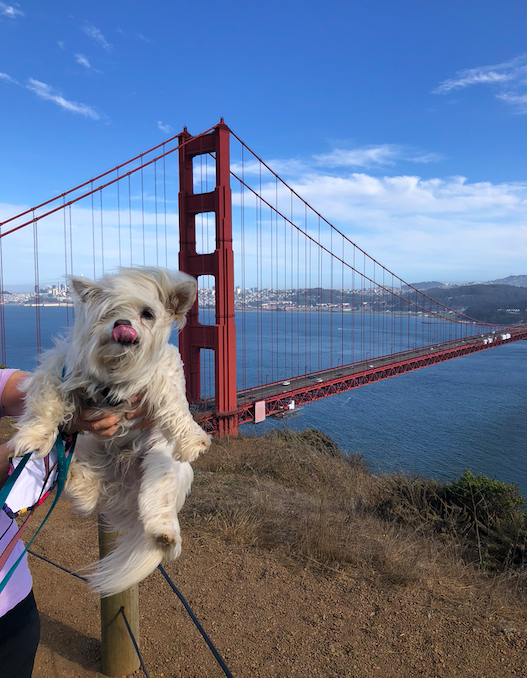
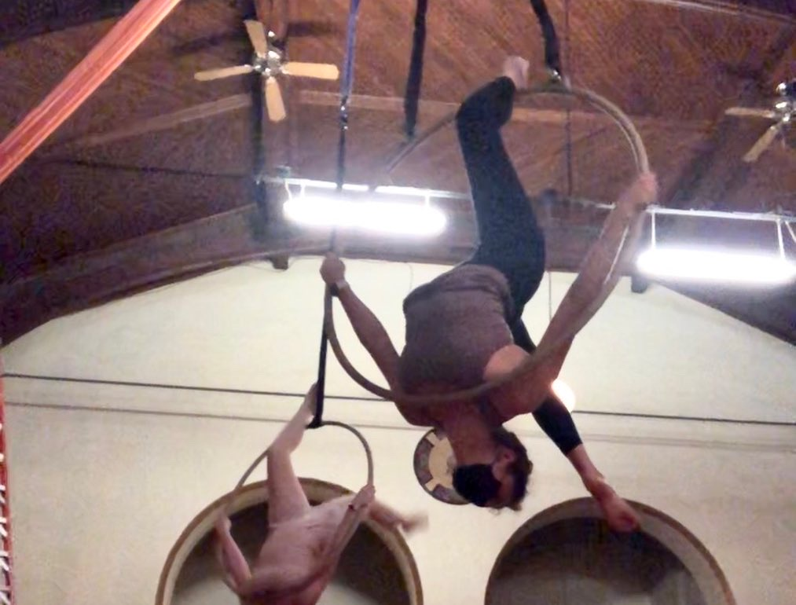
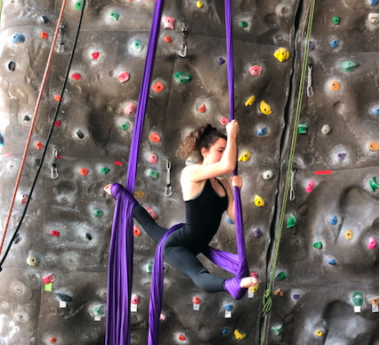
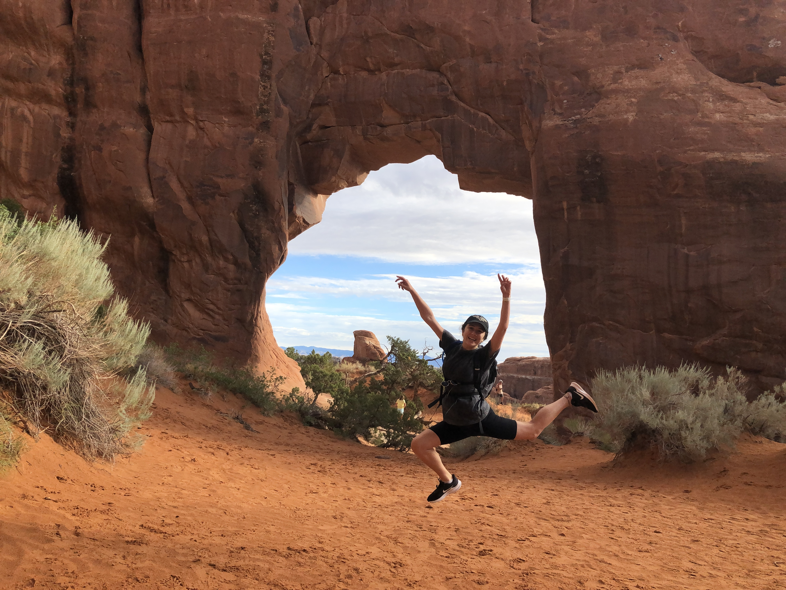

```{r setup, include=FALSE}
knitr::opts_chunk$set(echo = FALSE)
```
1. I’m originally from San Francisco, Ca.
```{r pic1, out.width='50%', out.height='50%', echo=FALSE, layout="l-body", fig.align = 'center', fig.cap='Darwin at the Golden Gate Bridge'}

```
2. I do aerial arts (like you can see in cirque du soleil!). I can do silks, trapeze, and hoop/lyra, but my favorite is lyra. 
```{r pic2, out.width='50%', out.height='50%', echo=FALSE, layout="l-body", fig.align = 'center', fig.cap='Lyra'}

```
```{r pic3, out.width='50%', out.height='50%', echo=FALSE, layout="l-body", fig.align = 'center', fig.cap='Silks'}

```
3. I love to bake, especially chocolate chip cookies.

4. I have a dog named Darwin after Charles Darwin (in the first pic!).

5. I love being outside and active. On the weekends I’m usually hiking, camping or exploring Baltimore!
```{r pic4,out.width='50%', out.height='50%', echo=FALSE, layout="l-body", fig.align = 'center', fig.cap='Arches National Park'}

```
