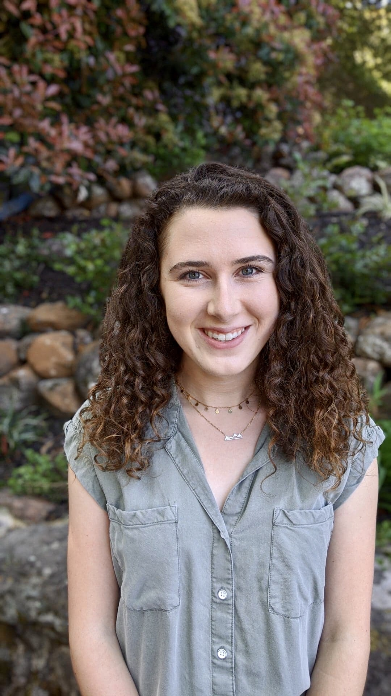

```{r setup, include=FALSE}
knitr::opts_chunk$set(echo = TRUE)
```


```{r picture, echo=FALSE, fig.align = 'center', out.width='50%', out.height='50%'}

```


## About Me

I'm a third year Human Genetics PhD student. As a wet lab researcher, I only know the basics of coding in R and statistics, but I’m looking forward to learning more throughout this course!!

## Research Interests

I study the epigenetics of pancreatic cancer in Andy Feinberg's lab. Specifically, I'm interested in how epigenetic changes lead to distant metastasis. I test how drugs effecting metabolism can reverse these epigenetic changes and increase patient lifespan.